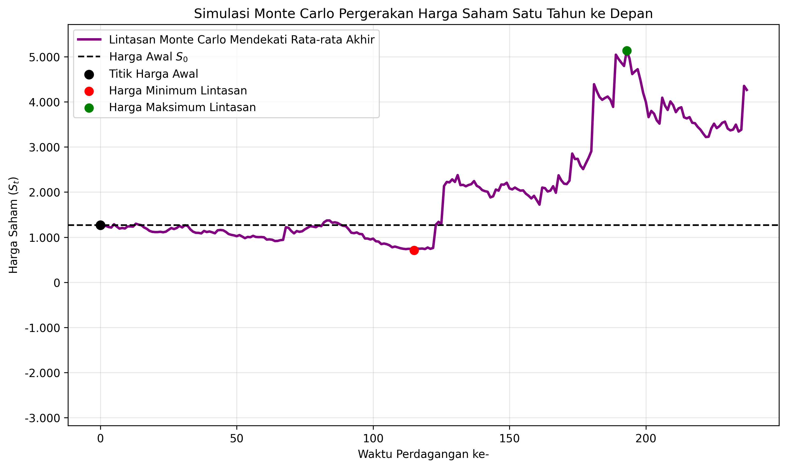
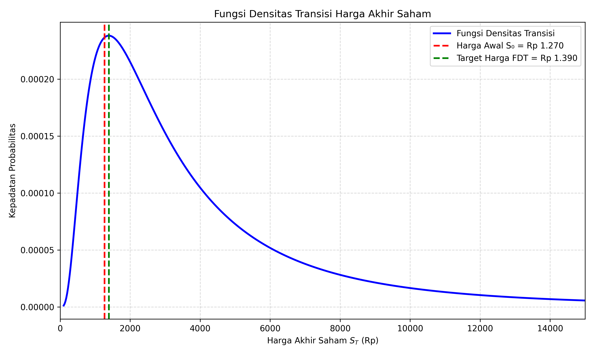

# 📈 Quantitative Finance: Stock Price Modeling using Heston-Kou Model

## 📝 Project Overview
This repository contains the Python implementation of the **Heston-Kou Stochastic Volatility and Jump-Diffusion Model**, developed as my final-year Mathematics thesis (Tugas Akhir) at Universitas Diponegoro. 

Complementing my data analytics and business intelligence projects from my independent study at Vinix [cite: selamat malam saya ingin membuat portofolio untuk linkedin berdasarkan kegiatan yang pernah saya lakukan. pertama kita mulai dari studi independen saya di vinix. saran kamu portofolio apa yang perlu saya buat agar sesuai dengan background saya sebagai data analis], this project showcases advanced quantitative analysis, numerical methods, and financial mathematical modeling. 

Unlike standard models (e.g., Black-Scholes) that assume constant volatility, the Heston-Kou model provides a highly realistic simulation of financial markets by accounting for random (stochastic) volatility and sudden price jumps caused by real-world market shocks.

## 🚀 Core Features & Methodology
1. **Data Discretization & Jump Detection:** Uses Median Absolute Deviation (MAD) on the historical dataset (`olah dataa.csv`) to identify market jumps.
2. **Parameter Estimation:** 
   - *Kou Model:* Estimates jump intensity ($\lambda$), probabilities ($p, q$), and exponential rates ($\eta_1, \eta_2$).
   - *Heston Model:* Calibrates mean reversion ($\kappa$), long-term variance ($\theta$), volatility of variance ($\sigma_v$), and correlation ($\rho$).
3. **Monte Carlo Simulation:** Generates 10,000 simulated paths to forecast stock prices and volatility over a 1-year horizon.
4. **Transition Density Function (FDT):** Calculates the exact target price and analytical probabilities using numerical integration (`scipy.integrate`).

## 📊 Key Results & Visualizations

### 1. Simulated Stock Price Path (Monte Carlo)

*> The chart above illustrates a representative Monte Carlo path, highlighting the stochastic volatility behavior and discrete jumps over the trading period.*

### 2. Transition Density Function (FDT) & Target Price

*> This analytical curve determines the most probable target price and the statistical distribution of the final price at the end of the period.*

### 3. Estimated Parameters Summary
*(Derived from historical data estimation)*

| Component | Parameter | Value | Description |
| :--- | :--- | :--- | :--- |
| **Kou (Jump)** | Lambda ($\lambda$) | `17.000000` | Jump intensity per year |
| | p | `0.882353` | Probability of Upward Jump |
| | q | `0.117647` | Probability of Downward Jump |
| **Heston (Diffusion)** | Kappa ($\kappa$) | `11.251286` | Rate of mean reversion |
| | Theta ($\theta$) | ` 0.266832 ` | Long-term variance |
| | Sigma_v ($\sigma_v$) | `203.760899 ` | Volatility of variance |

*(Note: The complete parameter set is generated in `parameter_heston_kou.csv`)*

### 4. Probability Analysis (FDT vs Monte Carlo)
| Methodology | Probability of Price Increase | Target Price Forecast |
| :--- | :--- | :--- |
| **Monte Carlo (10,000 paths)** | `83.870000%` | - |
| **Transition Density Function (FDT)** | `83.650445%` | `Rp Rp 1.390` |

## 🛠️ Tools & Technologies Used
* **Language:** Python 3
* **Libraries:** NumPy, Pandas, SciPy (Optimization & Integration), Matplotlib
* **Input Data:** `olah dataa.csv` (Historical stock dataset)

## 👨‍💻 Author
**Maulana Fatih Abiyyin**
* Data Analyst | Mathematics Graduate from Universitas Diponegoro
